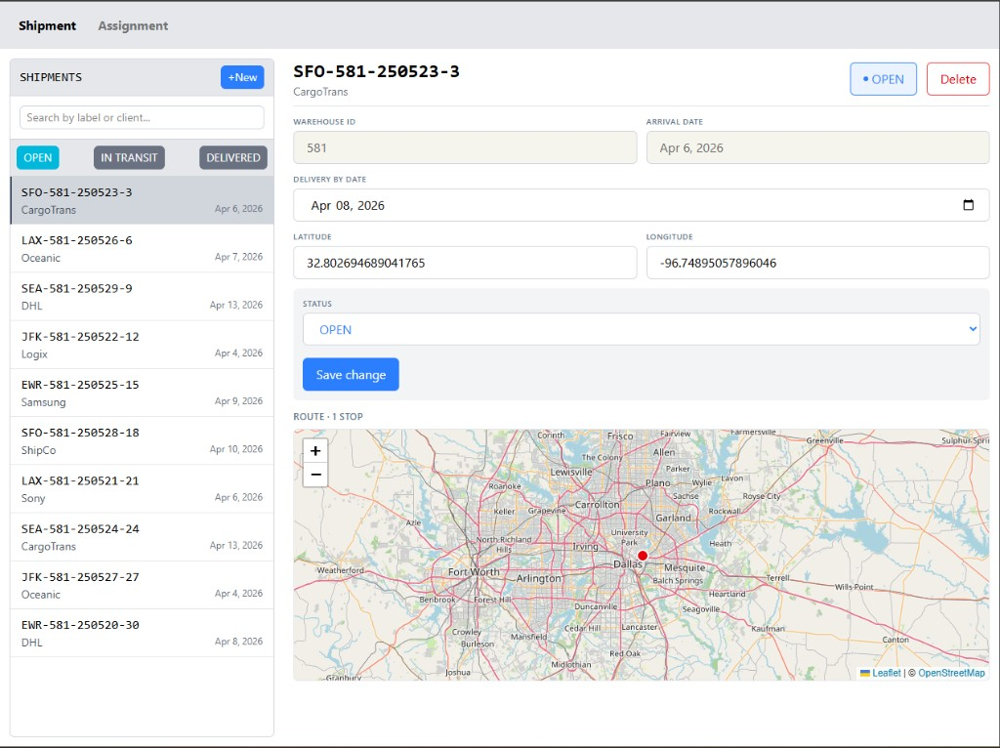
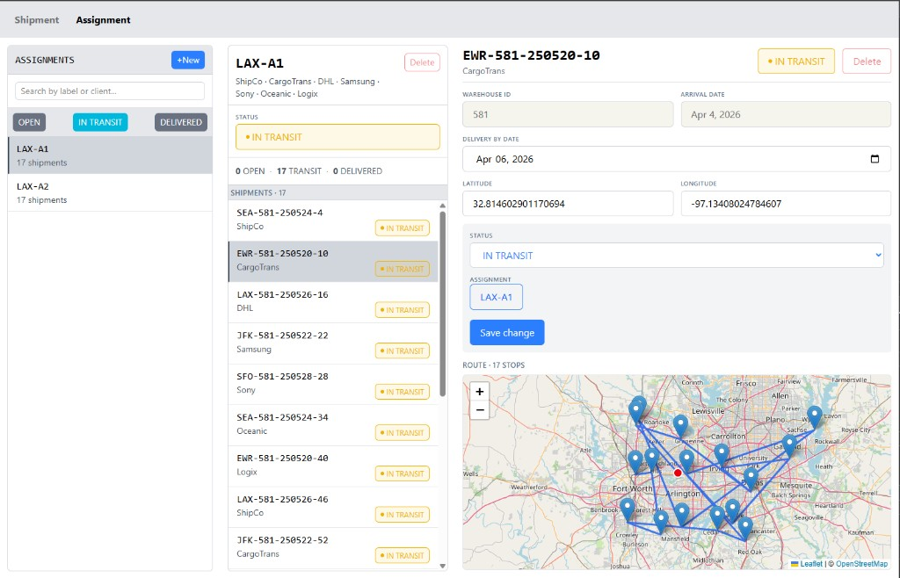
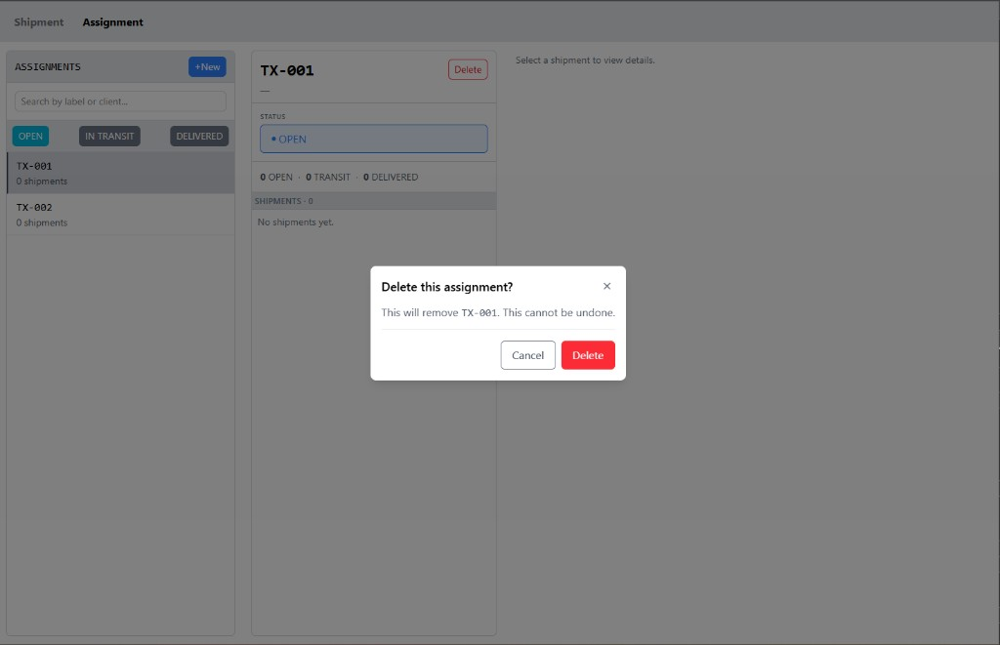

# Shipdash

React (Vite) dashboard for **shipments** and **assignments** (lists, forms, Leaflet map). Data: **`db.json`** + **[json-server](https://github.com/typicode/json-server)** on **port 3001**.

## Current limitations

- **Virtualization** — Shipment and assignment lists are not virtualized; large lists may be slow.
- **Leaflet** — Map UI was built with **heavy AI help**; limited hands-on study of the library.
- **`generated-data.cjs`** — Tweaked from an earlier seed script so **`db.json`** matches the app schema; adjust and re-run if models change.
- **Vite + `db.json`** — Vite watches the repo; json-server **rewrites `db.json` on each API write**, which can **reload the dev UI** and feel janky. Prefer **`db.json` outside the project** (e.g. `../shipdash-data/db.json`) and run `pnpm exec json-server --watch <that-path> --port 3001`; copy there after `node generated-data.cjs` if needed.
- **Toasts** — No **Toast** component yet for create/update/delete feedback.

**Stack:** React 19, TS, Vite, Tailwind, TanStack Query, Zustand, React Router, Leaflet / react-leaflet.

## Setup

**Prerequisites:** Node (LTS), **pnpm**.

```bash
pnpm install
node generated-data.cjs   # optional: (re)builds ./db.json
pnpm api                  # json-server → http://localhost:3001  (see src/api/index.ts)
pnpm dev                  # http://localhost:5173
# or: pnpm dev:all
```

**Build:** `pnpm build` · `pnpm preview`

## Demo




